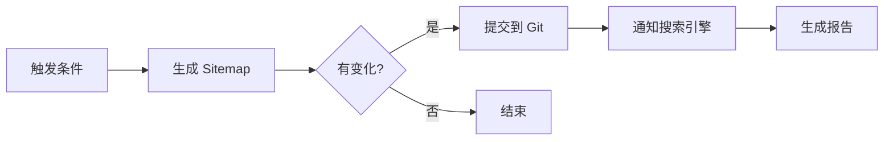
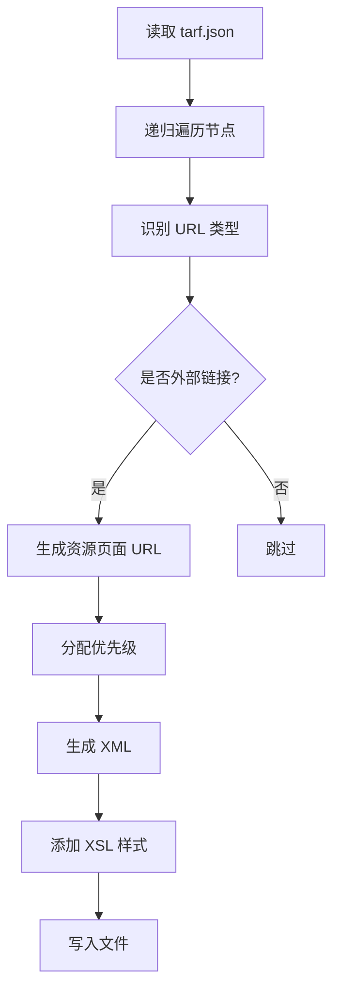

# SEO 自动化说明

## 📖 概述

本项目已配置完整的 SEO 自动化机制，通过 GitHub Actions 自动维护 sitemap 并定期提交给搜索引擎，逐步提升 Google 收录率。

## 🤖 自动化功能

### 1. Sitemap 自动更新

**工作流文件**: `.github/workflows/update-sitemap.yml`

**触发条件**:
- ✅ **每周定时**: 每周一上午 9:00 (UTC) 自动运行
- ✅ **内容更新**: 当 `docs/tarf.json` 文件更新时触发
- ✅ **手动触发**: 可在 GitHub Actions 页面手动运行

**自动化流程**:
1. 检测 tarf.json 资源变化
2. 自动生成完整的 sitemap.xml（包含所有资源页面）
3. 如果 sitemap 有更新，自动提交到 Git
4. 通知 Google、Bing 等搜索引擎更新
5. 生成执行报告

### 2. Sitemap 生成脚本

**脚本文件**: `scripts/generate_sitemap.py`

**功能特性**:
- 📊 自动扫描 tarf.json 中的所有资源（1800+ 资源）
- 🔗 为每个资源生成独立的 SEO 友好 URL
- 📅 自动更新 lastmod 时间戳
- ⭐ 根据页面深度智能分配优先级（0.6-1.0）
- 🎯 支持主页、资源页、静态页全类型覆盖

**生成的 URL 结构**:
- 主页: `https://digidai.github.io/recruit-ai-framework/`
- 资源页: `https://digidai.github.io/recruit-ai-framework/?resource=res-{id}`

### 3. 搜索引擎提交

**脚本文件**: `scripts/submit_sitemap.py`

**支持的搜索引擎**:
- Google (必选)
- Bing (可选)
- Yandex (可选)

## 📊 当前状态

- **总页面数**: 1805+ 个 URL
- **资源页面**: 1801 个
- **静态页面**: 4 个
- **更新频率**: 每周自动更新
- **优先级策略**: 智能分层（1.0 → 0.6）

## 🚀 使用方法

### 方法 1: 自动运行（推荐）

无需任何操作，GitHub Actions 会自动：
1. 每周一自动更新 sitemap
2. 添加新资源时自动更新
3. 自动通知搜索引擎

### 方法 2: 手动触发

1. 访问 GitHub 仓库
2. 点击 "Actions" 标签
3. 选择 "Auto Update Sitemap" 工作流
4. 点击 "Run workflow" → "Run workflow"

### 方法 3: 本地生成

```bash
# 生成 sitemap
python3 scripts/generate_sitemap.py

# 提交到搜索引擎（可选）
python3 scripts/submit_sitemap.py --engines google,bing
```

## 📈 SEO 优化策略

### Sitemap 结构优化

1. **优先级分层**
   - 主页: 1.0 (最高优先级)
   - 一级资源: 0.9
   - 二级资源: 0.8
   - 深层资源: 0.6-0.7

2. **更新频率**
   - 主页: weekly（每周更新）
   - 资源页: monthly（每月更新）
   - 静态页: monthly

3. **URL 设计**
   - 使用查询参数 `?resource=res-{id}`
   - 便于 JavaScript 路由处理
   - SEO 友好的 URL 结构

### 收录加速技巧

1. **robots.txt 配置** ✅ (已配置)
   ```
   Sitemap: https://digidai.github.io/recruit-ai-framework/sitemap.xml
   ```

2. **Google Search Console** (推荐配置)
   - 添加网站验证
   - 提交 sitemap.xml
   - 监控索引状态

3. **内部链接优化**
   - 确保所有资源页可从主页到达
   - 使用合理的链接结构

## 🔍 监控与验证

### 查看 Sitemap

访问: https://digidai.github.io/recruit-ai-framework/sitemap.xml

### 验证 Google 收录

1. 在 Google 搜索: `site:digidai.github.io/recruit-ai-framework`
2. 查看 Google Search Console 的"覆盖率"报告
3. 监控索引页面数量增长

### 查看自动化日志

访问: https://github.com/Digidai/recruit-ai-framework/actions

选择 "Auto Update Sitemap" 工作流查看最近的运行记录。

## 🛠️ 自定义配置

### 修改更新频率

编辑 `.github/workflows/update-sitemap.yml`:

```yaml
schedule:
  # 每周一上午 9:00 (UTC)
  - cron: '0 9 * * 1'

  # 改为每天运行:
  # - cron: '0 9 * * *'

  # 改为每月运行:
  # - cron: '0 9 1 * *'
```

### 添加更多搜索引擎

编辑 `.github/workflows/update-sitemap.yml`，在 "Notify Google" 步骤后添加：

```yaml
- name: Notify Bing
  run: |
    curl -s "https://www.bing.com/ping?sitemap=https://digidai.github.io/recruit-ai-framework/sitemap.xml"
```

### 修改优先级策略

编辑 `scripts/generate_sitemap.py` 中的 `extract_all_urls` 函数:

```python
# 当前: 根据深度递减 0.1
'priority': max(0.6, 1.0 - depth * 0.1)

# 改为固定优先级:
'priority': 0.8

# 改为更激进的递减:
'priority': max(0.5, 1.0 - depth * 0.15)
```

## 📝 工作流详解

### GitHub Actions 工作流



### Sitemap 生成流程



## 🔧 故障排查

### Sitemap 未更新

**检查项**:
1. GitHub Actions 是否正常运行
2. tarf.json 是否有变化
3. 查看工作流日志

### Google 未收录

**可能原因**:
1. 网站上线时间较短（需要 1-2 周）
2. 需要在 Google Search Console 手动提交 sitemap
3. 检查 robots.txt 是否正确配置

**解决方案**:
```bash
# 手动通知 Google
curl "https://www.google.com/ping?sitemap=https://digidai.github.io/recruit-ai-framework/sitemap.xml"
```

### 工作流失败

**查看日志**:
1. 进入 GitHub Actions 页面
2. 点击失败的工作流运行
3. 查看详细错误信息

**常见问题**:
- Python 版本不兼容
- tarf.json 格式错误
- 文件权限问题

## 📚 相关资源

- [Google Sitemap 协议](https://www.sitemaps.org/protocol.html)
- [GitHub Actions 文档](https://docs.github.com/en/actions)
- [Google Search Console](https://search.google.com/search-console)
- [SEO 最佳实践](SEO_OPTIMIZATION_SUMMARY.md)

## 🎯 预期效果

实施完整的 SEO 自动化后，预期效果：

**第 1-2 周**:
- ✅ Sitemap 自动运行
- ✅ Google 开始爬取站点
- 📊 预计收录: 50-200 页

**第 1-2 月**:
- ✅ 大部分页面被索引
- 📊 预计收录: 1000-1500 页
- 📈 有机流量开始增长

**第 3-6 月**:
- ✅ 全部页面完全索引
- 📊 预计收录: 1800+ 页
- 📈 稳定的有机搜索流量

## 💡 最佳实践

1. **保持内容更新**: 定期添加高质量资源
2. **监控收录状态**: 每月检查 Google Search Console
3. **优化页面质量**: 确保 meta 标签、结构化数据完整
4. **构建外链**: 适量建立高质量外链
5. **提升用户体验**: 优化页面加载速度、移动端体验

---

## 📞 支持

如有问题或建议，请：
1. 查看 GitHub Issues
2. 提交新的 Issue
3. 贡献代码改进

---

**最后更新**: 2026-01-06
**维护者**: Digidai
**状态**: ✅ 运行中
